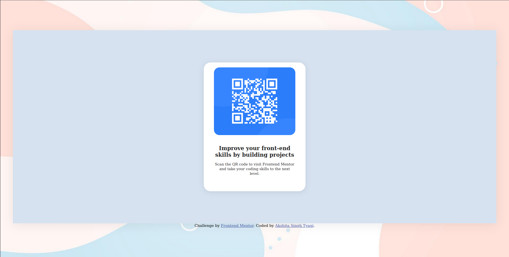

# Frontend Mentor - QR code component solution

This is a solution to the [QR code component challenge on Frontend Mentor](https://www.frontendmentor.io/challenges/qr-code-component-iux_sIO_H). Frontend Mentor challenges help you improve your coding skills by building realistic projects.

## Table of contents

- [Overview](#overview)
  - [Screenshot](#screenshot)
  - [Links](#links)
- [My process](#my-process)
  - [Built with](#built-with)
  - [What I learned](#what-i-learned)
  - [Continued development](#continued-development)
  - [Useful resources](#useful-resources)
- [Author](#author)
- [Acknowledgments](#acknowledgments)

## Overview

A simple, responsive QR code component built with semantic HTML and modern CSS. The component is centered on the page with a soft blue background, a white card with rounded corners, and a QR code image above descriptive text.

### Screenshot



### Links

- Solution URL: [https://github.com/Aki-max-min/qr-code-component](https://github.com/Aki-max-min/qr-code-component)
- Live Site URL: [https://yourusername.github.io/qr-code-component/](https://yourusername.github.io/qr-code-component/)

## My process

### Built with

- Semantic HTML5 markup
- CSS custom properties
- Flexbox
- Mobile-first workflow

### What I learned

- How to use Flexbox to center content both vertically and horizontally.
- How to use `vh` and `vw` units for responsive sizing.
- How to overlay and style boxes with different backgrounds and border radii.
- How to make images fit nicely inside containers using `object-fit: cover`.

```html
<div class="white-box">
  
  <div class="box-text-vertical">
    <span>Improve your front-end skills by building projects</span>
    <span>Scan the QR code to visit Frontend Mentor and take your coding skills to the next level.</span>
  </div>
</div>
```

```css
.center-box {
  background: hsl(212, 45%, 89%);
  width: 95vw;
  height: 75vh;
  display: flex;
  justify-content: center;
  align-items: center;
}
.white-box {
  background: hsl(0, 0%, 100%);
  width: 30vw;
  height: 20vh;
  border-radius: 20px;
  display: flex;
  flex-direction: column;
  align-items: center;
}
```

### Continued development

- Practice more with CSS Grid for layout.
- Explore accessibility improvements for screen readers.
- Experiment with CSS transitions and hover effects.

### Useful resources

- [MDN Web Docs - Flexbox](https://developer.mozilla.org/en-US/docs/Web/CSS/CSS_Flexible_Box_Layout/Basic_Concepts_of_Flexbox)
- [Frontend Mentor](https://www.frontendmentor.io/) - Great for real-world practice projects.

## Author

- Website - [Akshita Singh Tyagi](https://your-website.com)
- Frontend Mentor - [@Aki-max-min](https://www.frontendmentor.io/profile/Aki-max-min)


## Acknowledgments

Thanks to the Frontend Mentor community for feedback and inspiration!